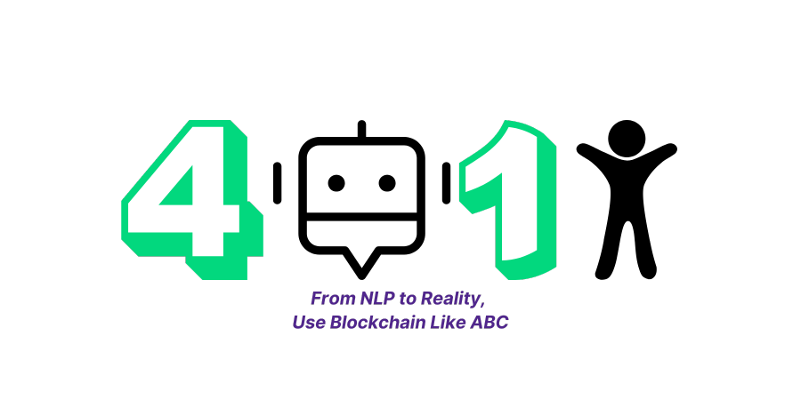

# 4AI 1Human: A Customizable Agentic Interface
**From NLP to Reality: Use Blockchain Like ABC**

A customizable, AI-driven **interface** that lets you send funds with the exact requirements you choose—or manage any transaction the way you envision. Simply connect MetaMask, describe your desired on-chain logic in plain English, and our system will make it happen.

---

## Inspiration: How We Came Up with This Idea

One of our friends needed funds to stake in an ETHGlobal agentic hackathon. We sent her some ETH, but it disappeared immediately because her private key was compromised. This incident highlighted a serious gap: there was no easy way to control **how** funds were used or to retrieve them if misused.

We thought:

> *“What if we could tell an AI, in plain language, exactly how we want our funds handled, like ‘Send 0.2 ETH to Alice, but only for staking in ETHGlobal; otherwise, return it’ and have the interface automatically enforce these conditions?”*

That sparked the idea of a **Customizable Agentic Interface**, where you simply describe the rules (time locks, passwords, usage restrictions, or refunds if conditions aren’t met), and the system takes care of the rest. No manual coding. No guesswork. The only limitation is your imagination.

---

## The Problem

Traditional methods of sending crypto typically handle only **basic transfers**, lacking native support for:

1. **Usage Restrictions** (e.g., “You must stake in a specific contract.”)  
2. **Conditional Withdrawals** (e.g., “Only allowed after a certain event or time.”)  
3. **Advanced Fund Management** (e.g., multi-sig approvals, milestone payouts.)

Essentially, a standard MetaMask send transaction can’t impose custom requirements. Users who want these features end up writing their own code, relying on complex escrow services, or risking misuse of funds. Meanwhile, many AI-based solutions focus on **basic transfers** only and they don’t allow you to truly customize how (or why) funds move.

**Our AI-driven interface changes that**: simply **tell** the system your desired conditions, and it will **enforce** them automatically **without** any advanced coding required.

---

## The Solution

1. **Understands Plain English Instructions**  
   > *Example: “Transfer 0.2 ETH to Bob. He can only withdraw if he stakes it in ETHGlobal by Friday; otherwise, it returns to me.”*

2. **Generates and Deploys Custom Logic Automatically**  
   In the background, our system:  
   - **Generates** a contract tailored to your requirements (e.g., escrow, multi-sig, conditional payouts, password protection, and more).  
   - **Compiles** and **deploys** that contract on-chain.  
   - **Verifies** the contract on a blockchain explorer for transparency.

3. **Easy Interaction**  
   - Users interact with the verified contract via **plain English** commands.  
   - For instance, if User A creates a fund transfer contract for User B, then User B can simply say, “Help me connect to contract address XYZ to claim my funds,” and the AI handles the rest.  
   - The interface **recognizes** functions, **asks** for any needed parameters, and **executes** the calls.  
   - **No manual coding** or complicated escrow setup required.

4. **Flexible Use Cases**  
   - Beyond simple transfers, you can define **multi-sig requirements**, **milestone payouts**, or **any customizable on-chain condition** the AI can interpret and enforce during contract generation. 

---

## How Our Project Works

Though the user experiences a **single AI-driven interface**, there are actually **four specialized AI agents** working behind the scenes. We call this system **“4 AI, 1 Human”**, where you (the user which is a human) interact with these 4 agents to manage on-chain actions:

1. **Finn the Finder** (For Creating or Accessing Contracts)  
   - Determines whether the user wants to **create a new** contract or **interact with** an existing one.  
   - Detects invalid prompts (like prompt injection) and routes the request accordingly.

2. **Codey the Creator** (For Creating Contracts)  
   - **Interprets** the user’s natural-language requirements to **generate** a new contract (e.g., “Stake before Friday,” “Require a password,” “Set up multi-sig”).  
   - Produces the underlying logic for that contract.

3. **Vee the Verifier** (For Connecting to Existing Contracts)  
   - **Verifies** any requested action against the **contract’s ABI**.  
   - Identifies the function the user intends to call, checks parameters, then hands off to Dex.

4. **Dex the Developer** (For Connecting to Existing Contracts)  
   - **Retrieves** the relevant function details from the contract’s ABI.  
   - **Prompts the user** for required parameters.  
   - **Executes** the action on-chain once all data is confirmed.

---

### Project Flow (Creating a Contract)

1. **User Command**  
   - The user types a plain-English instruction, such as:  
     > *“Send 0.2 ETH to Bob, but only if he stakes by Friday.”*  
   - **Finn** detects this as a **new contract request**.

2. **Contract Creation**  
   - **Codey** converts these requirements into the proper contract logic (escrow, conditions, etc.).  
   - The system **compiles** the contract, **deploys** it on-chain, and **verifies** it on a blockchain explorer.

---

### Project Flow (Connecting to an Existing Contract)

1. **Parameter Gathering & Execution**  
   - If the user wants to **interact** with an existing contract, **Vee** checks which function is being called and validates the parameters.  
   - **Dex** loads the contract’s ABI, asks the user for any required info, and **executes** the function on-chain.

2. **User Interaction**  
   - The user might sign **one transaction** for a single function call or multiple if several actions are needed.  
   - Others (like recipients or authorized parties) can also connect to the contract through the **same AI-driven interface**, making the entire process straightforward.

---

## Architecture & Tech Stack

### Architectural Diagram

1. **User ↔ AI Interface**  
   - The user specifies requirements or requests to connect to a contract. The AI interface interprets these plain-English commands.

2. **AI Interface ↔ Nillion**  
   - Chat histories and user data are securely stored/retrieved from **Nillion SecretVault**, preserving privacy while still allowing on-chain logic to be enforced.

3. **AI Interface ↔ Flow blockchain**  
   - The AI compiles user-defined logic, deploys it as a smart contract on Flow, and verifies that contract on a block explorer.  
   - The user can also interact with existing contracts via the AI, which reads/writes to Flow.

4. **AI Interface ↔ EigenLayer**  
   - For tamper-proof proof-of-origin, the system creates and responds to tasks in EigenLayer’s AVS. The full conversation hash is signed by the AI, then recorded on-chain, ensuring the logic is AI-generated and unmodified.

---

### Tech Stack Overview

- **Three.js** – Used for 3D and interactive UI elements.  
- **Flow blockchain** – Hosts the compiled smart contracts; integration via EVM-compatible Flow testnet.  
- **Nillion** – Securely stores user chat logs and encrypted data.  
- **EigenLayer** – Provides an AVS for tamper-proof hashing and verification of AI-generated code/conversations.  
- **Hyperbolic API** – An LLM service built on EigenLayer, delivering advanced NLP to the AI interface.  
- **OpenAI API** – Additional NLP or generative text support for understanding user prompts.  
- **Next.js** – Web framework for building the front-end interface.  
- **HeroUI** – Deployment platform for hosting the application’s backend.  
- **Ngrok** – Allows us to expose our local development server to the internet, making it easy to test, debug, and share our application and able to deploy it fully.
- **WalletConnect** – Enables seamless connection between users’ crypto wallets (e.g., MetaMask) and our AI interface, allowing them to interact with smart contracts directly.
- **Hardhat** – Used as our Ethereum smart contract development and testing framework, providing tools to compile, deploy, and debug Solidity contracts.
- **Foundry** – Used as our AVS smart contract development and testing framework

---

## How We Use Flow blockchain

We integrate Flow’s **EVM-compatible testnet** to provide a **consumer-friendly** on-chain experience. Our AI system **compiles**, **deploys**, and **verifies** Solidity contracts on Flow simply by pointing Hardhat to Flow’s RPC URL (via Alchemy). Once deployed, you can view these contracts on [Flow’s Blockscout explorer](https://evm-testnet.flowscan.io/). For instance, here are some **verified smart contract** generated by our AI on Flow:

- [Contract Address 1 on Flow EVM Testnet](https://evm-testnet.flowscan.io/address/0x71cfE0f205c0A05e1bC84f29D95351Cd958E4581?tab=contract)
- [Contract Address 2 on Flow EVM Testnet](https://evm-testnet.flowscan.io/address/0x74544b05aE0F30028bBf35CACE0114Faf0E794cc#code)
- [Contract Address 3 on Flow EVM Testnet](https://evm-testnet.flowscan.io/address/0x71cfE0f205c0A05e1bC84f29D95351Cd958E4581?tab=contract)

**What We Integrated & How**  
- We added Flow’s RPC endpoint in our Hardhat config, using **Alchemy** to connect.  
- We compile the Solidity, then **deploy** to Flow’s network and **verify** via the Blockscout interface.  
- [Link to Compile and Deploy Smart Contract]([#](https://github.com/JingYuan0926/agentic/blob/main/pages/api/codey.js)) 
- [Verification Script (https://github.com/JingYuan0926/agentic/blob/main/pages/api/verify.js)

By doing so, **everyday users** can simply give a **plain-English** instruction (e.g., “Send 0.2 FLOW to Bob with a time lock”), and our AI interface automates the entire Flow contract interaction—**no** coding required.

---

## How We Use Nillion

We leverage **Nillion SecretVault** to **securely store** each user’s **chat history** and other agent data:

- **Encryption with nilQL** prevents unauthorized access to sensitive conversation details.  
- **Wallet address** and **chat ID** remain unencrypted, serving as lookup keys so a user can retrieve their chat logs (similar to a “ChatGPT history”).  
- The **actual messages** are encrypted for privacy.

**Example Workflow**  
- A user with address `0x123` has multiple chat sessions identified by unique `chatId`.  
- Each message within a `chatId` is fully encrypted in Nillion.  
- Our AI agents retrieve the encrypted data securely and only process the metadata needed for on-chain actions.
  
**What We Integrated**
- [SecretVault Write/Read Logic](https://github.com/JingYuan0926/agentic/blob/main/pages/api/nillion-test.js)
- [nilQL Encryption Implementation](https://github.com/JingYuan0926/agentic/blob/main/pages/chat.js)

---

## How We Use EigenLayer

We built a **custom Active/Validator Service (AVS)** on EigenLayer to maintain **tamper-proof records** of each conversation and resulting contract code. Instead of just verifying the AI’s response, we ensure that the **entire interaction**, from user prompt to final output is cryptographically secured and recorded on-chain.

1. **Hashing the Entire Conversation**  
The full chat session, including the user’s prompt and the AI’s response and generated contract, is hashed to ensure integrity:

 `hashBeforeSign = Hash(prompt + MyContract.sol)`

2. **AI-Signed Verification**  
Our AI (holding a private key in this PoC setup) cryptographically signs the hash to prove its authenticity:

  `signature = Sign_AI_PrivateKey(hashBeforeSign)`

3. **User Submission & Task Creation**  
The user submits the full chat session hash to AVS to create a task for verification and on-chain recording:

`createTask(hashBeforeSign, signature)`

3. **On-Chain Proof Generation**  
Our AVS operator verifies the submitted conversation and its AI-generated output, ensuring it has not been altered and respond to the user's task:

`Verify(AI_PublicKey, hashBeforeSign, signature)`

5. **Final Validation & Record Creation**  
If the verification is valid, an **on-chain record** is created, the **user's prompt**, **AI-generated contract**, and **AVS validation proof** is stored on-chain as a **tamper-proof record**.
Additionally, the **hashes of the created task and the operator’s response** are provided to the user.

**Smart Contract & Front-End**  
- [AVS Smart Contract Directory](https://github.com/JingYuan0926/agentic/tree/main/ai-avs)  
- [Deployed on Holesky Testnet](https://holesky.etherscan.io/address/0x610c598A1B4BF710a10934EA47E4992a9897fad1)  
- [Front-End Code for Task Creation](https://github.com/JingYuan0926/agentic/blob/main/components/OnChainProof.js)
- [Front-End Code for Respond to Task](https://github.com/JingYuan0926/agentic/blob/main/pages/api/operator-response.js)

Additionally, we integrated **Hyperbolic API** (built on EigenLayer) as our **LLM** provider, further showcasing **AVS-based** AI logic. This allows us to deliver **advanced NLP** capabilities within our agentic framework, all backed by **EigenLayer’s** security and verifiability. This can be verified in this code: [API Call to Hyperbollic LLM](https://github.com/JingYuan0926/agentic/blob/main/utils/aiConfig.js)

---

## Future Implementations

1. **Native Smart Wallet**  
   - Instead of relying on external EOAs (like MetaMask), we plan to build our **own smart wallet** solution. This would let us programmatically tailor each account’s logic and other conditions **directly** at the wallet level.

2. **Deeper Account Abstraction**  
   - With full **account abstraction**, users would never handle low-level transactions themselves. They’d simply describe what they want in plain English, and our AI-managed wallet would pay gas, schedule actions, or enforce constraints automatically—further simplifying the user experience.

3. **Enhanced Security & Recovery**  
   - By controlling the entire smart wallet layer, we can offer built-in **social recovery**, session keys, or advanced authorization mechanisms—protecting users from private-key leaks and other common pitfalls.

These improvements will **eliminate the need** for a separate wallet interface (like MetaMask) and **unlock a fully customizable**, AI-driven on-chain ecosystem. 

---

## Team

- **Derek Liew Qi Jian**  
  - *Role*: Project Lead, AI & Backend  
  - [LinkedIn](https://www.linkedin.com/in/derek2403/) | [Twitter](https://x.com/derek2403)

- **Phen Jing Yuan**  
  - *Role*: Backend & Frontend Integration  
  - [LinkedIn](https://www.linkedin.com/in/jing-yuan-phen-b42266295/) | [Twitter](https://x.com/ilovedahmo)

- **Marcus Tan Chi Yau**  
  - *Role*: Backend  
  - [LinkedIn](https://www.linkedin.com/in/marcus-tan-8846ba271/)

- **Cedric Chung**  
  - *Role*: Frontend Development  
  - [LinkedIn](https://www.linkedin.com/in/cedric-chung-2756b4310/)

- **Tan Zhi Wei**  
  - *Role*: Frontend & UI/UX Design  
  - [LinkedIn](https://www.linkedin.com/in/tanzhiwei0328/)

